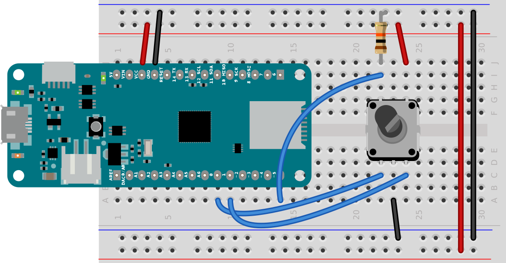

# Examples from Beihang Lighting Workshop

All the rotary encoder examples in this repository are based on the circuit below:

_Figure 1. Rotary encoder attached to a MKR board. The pushbutton is connected to digital pin 5, and has a 10-kilohm pulldown resistor attached to it. The two pins of the rotary encoder are attached to digital pins 0 and 1._

Further examples from this workshop can be found in the [Light Projects repository](https://tigoe.github.io/LightProjects).