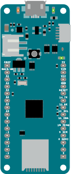
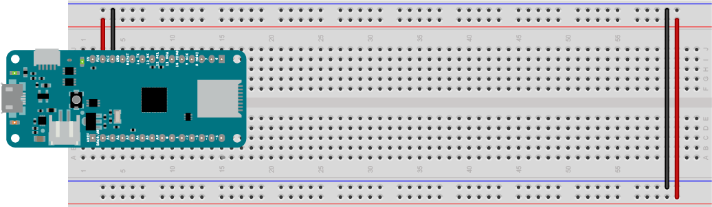

# Examples from Beihang Lighting Workshop

All the rotary encoder examples in this repository are based on the circuit below:

_Figure 1. Rotary encoder attached to a MKR board. The pushbutton is connected to digital pin 5, and has a 10-kilohm pulldown resistor attached to it. The two pins of the rotary encoder are attached to digital pins 0 and 1._

Further examples from this workshop can be found in the [Light Projects repository](https://tigoe.github.io/LightProjects).

Here is the pin diagram for the MKR boards:

### MKR Pin Layout
<table>
<tr>
<th>Left side pins</th>
<th></th>
<th>Right side pins</th>
</tr>
<tr>
<td style="vertical-align: top;">AREF 
A0/DAC0 
A1 (INT) 
A2 (INT) 
A3 (PWM) 
A4 (PWM) 
A5 
A6 
D0 (INT) 
D1 (INT) 
D2 (PWM) 
D3 (PWM) 
D4 (PWM) (INT) 
D5 (PWM) (INT) </td>
<td style="vertical-align: top;"> 
<em>Figure 2. MKR pin layout</em>
</td>
<td style="vertical-align: top;">
5V 
Vin - voltage in, 5V max. 
Vcc - 3.3V 
GND - ground 
reset 
D14 and Serial1 TX 
D13 and Serial1 RX 
D12 and I2C SCL 
D11 and I2C SDA 
D10 and SPI MISO (PWM) 
D9 and SPI SCK 
D8 and SPI MOSI (PWM) (INT) 
D7 (PWM) (INT) 
D6 and built-in LED (PWM) (INT) </td>
</tr>
</table>

_Note: Most pins have multiple functions. (PWM) indicates that a pin can be used with the `analogWrite` function. (INT) indicates that a pin can be used as an [external interrupt](https://www.arduino.cc/reference/en/language/functions/interrupts/interrupts/)._

This physical layout is sometimes referred to as a *DIP*, or *Dual Inline Package*. In a DIP package, physical pins are typically numbered from top left to bottom left, then from bottom right to top right. So physical pin 1 has the function Analog in 0, or A0; physical pin 14 has the function D5, or digital I/O 5; physical pin 15 has the function D6, or digital I/O 6; and pin 28 has the function 5V, or 5 volts supplied from the USB input.

The pins you'll use all the time are the third from the top on the right (physical pin 26), Vcc, which outputs 3.3 volts when the board is connected to a USB power source or a battery, and the fourth from top on the right (physical pin 25), GND, which is the ground pin. Remember, voltage is always a relative measurement between two points. The Vcc pin's voltage is measured relative to ground.

## Breadboard Setup
Plug your MKR into your breadboard with the top pins in the top row of the board. Connect the GND pin on the right side to the right side ground bus and the VCC pin to the voltage bus. Then connect the bus rows on the right side to their corresponding buses on the left. Figure 4 shows the board connected this way. The figure is rotated counter-clockwise so that the right hand side bus is on the top. Most of the circuit diagrams in these examples will be shown this way.

*Figure 3. MKR Zero on a breadoard with Vcc and GND connected to the voltage and ground bus rows. The bus rows are also wired to their counterparts on the opposite side*